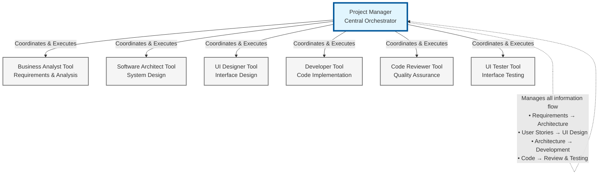

# Strands Coding Squad

A multi-agent software engineering team powered by GenAI agents that can analyze requirements, design systems, write code, and conduct reviews. This project implements a complete software development workflow using specialized AI agents working together.

## Features

- **Multi-Agent Architecture**: Specialized agents for different roles in software development
- **Multi-Model Optimization**: Different LLM models for different agent roles to optimize cost and performance
- **Intelligent Project Management**: AI-powered project manager orchestrates the entire workflow
- **Complexity-Aware Analysis**: Smart analysis that scales documentation and process to project complexity
- **Automated Project Organization**: Creates organized project folders with proper structure
- **Agent-Based Naming**: AI generates meaningful project names from requirements
- **Continuous Project Support**: Resume work on existing projects seamlessly
- **Dependency Management**: Agents provide structured outputs for downstream agents

## Architecture

The system follows a tool-based architecture with a central Project Manager agent coordinating specialized worker agents:

```
Project Manager Agent (Orchestrator)
├── Business Analyst Tool
├── Software Architect Tool
├── UI Designer Tool
├── Developer Tool
├── UI Tester Tool
└── Code Reviewer Tool
```

### Agent Workflow Graph



**Workflow Process:**

1. **Project Manager** receives requirements and orchestrates the entire workflow
2. **Project Manager** calls Business Analyst tool to analyze requirements and assess complexity
3. **Project Manager** calls Software Architect tool with requirements to design system architecture
4. **Project Manager** calls UI Designer tool with user stories to create interface designs
5. **Project Manager** calls Developer tool with architecture and designs to implement code
6. **Project Manager** calls Code Reviewer tool to ensure code quality and best practices
7. **Project Manager** calls UI Tester tool to validate interface functionality and accessibility

**Key Point**: The Project Manager is the single orchestrating agent that coordinates all work through tool calls. There are no independent agents - only tools that the Project Manager uses.

## Agent Roles

### Project Manager Agent

- **Role**: Main orchestrator and coordinator
- **Responsibilities**: Analyzes project requirements, plans workflow, delegates tasks
- **Location**: Runs directly within the application (`project_manager.py`)

### Business Analyst Agent

- **Role**: Requirements gathering and analysis
- **Responsibilities**: Creates user stories, analyzes stakeholders, assesses project complexity
- **Key Feature**: Smart complexity analysis to avoid over-engineering simple projects
- **Outputs**: Requirements, user stories, stakeholder analysis, risk assessment

### Software Architect Agent

- **Role**: System design and architecture
- **Responsibilities**: Designs system architecture, selects technology stack, defines patterns
- **Outputs**: System architecture, technology recommendations, design patterns, coding standards

### UI Designer Agent

- **Role**: User interface and experience design
- **Responsibilities**: Creates wireframes, mockups, design systems, accessibility guidelines
- **Outputs**: UI specifications, wireframes, design guidelines, accessibility standards

### Developer Agent

- **Role**: Code implementation
- **Responsibilities**: Writes code, implements features, creates tests, documentation
- **Outputs**: Source code, tests, documentation, deployment scripts

### Code Reviewer Agent

- **Role**: Code quality assurance
- **Responsibilities**: Reviews code quality, security, performance, best practices
- **Outputs**: Code review reports, quality metrics, security assessments

### UI Tester Agent

- **Role**: User interface testing
- **Responsibilities**: Tests UI functionality, accessibility, performance, browser compatibility
- **Outputs**: Test reports, bug findings, performance metrics, accessibility audits

## Tech Stack

- **Language**: Python
- **Framework**: [Strands Agents SDK](https://github.com/strands-agents/sdk-python)
- **Architecture**: Multi-agent system with tool-based workers
- **AI Models**: Multi-model approach with role-specific LLM optimization

## Project Structure

```
strands-coding-squad/
├── main.py                    # Main application entry point
├── project_manager.py         # Project Manager agent implementation
├── project_utils.py          # Project management utilities
├── context/                   # Agent context and prompts
│   ├── business_analyst.md
│   ├── software_architect.md
│   ├── ui_designer.md
│   ├── developer.md
│   ├── ui_tester.md
│   └── code_reviewer.md
├── tools/                     # Worker agent tools
│   ├── business_analyst.py
│   ├── software_architect.py
│   ├── ui_designer.py
│   ├── developer.py
│   ├── ui_tester.py
│   └── code_reviewer.py
└── tests/                     # Test files
```

## Generated Project Structure

Each project gets organized with a comprehensive, industry-standard structure:

```
project_YYYYMMDD_<ai_generated_name>/
├── src/                       # Source code
│   ├── app/                   # Main application code
│   ├── tests/                 # Test files and test suites
│   └── config/                # Configuration files
├── docs/                      # Documentation
│   ├── requirements/          # Business requirements and analysis
│   ├── architecture/          # System architecture and design
│   ├── reviews/               # Code review reports
│   └── api/                   # API documentation
├── assets/                    # Static resources
│   ├── designs/               # UI wireframes and mockups
│   ├── images/                # Images and graphics
│   └── data/                  # Sample/test data
├── staging/                   # Agent working folders (for traceability)
│   ├── business_analyst/
│   ├── software_architect/
│   ├── ui_designer/
│   ├── developer/
│   ├── ui_tester/
│   └── code_reviewer/
└── PROJECT_INFO.md           # Project metadata
```

## Getting Started

### Prerequisites

- Python 3.8+
- Strands Agents SDK

### Installation

1. Clone the repository:

```bash
git clone <repository-url>
cd strands-coding-squad
```

2. Install dependencies:

```bash
pip install -r requirements.txt
```

3. Set up the Strands Agents SDK according to their documentation.

### Usage

#### Starting the Application

```bash
python main.py
```

#### Available Commands

- **Create New Project**: Enter your project requirements
- **`list`**: View existing projects
- **`continue`**: Resume work on an existing project
- **`exit`**: Quit the application

#### Example Session

```
Software Engineer Squad - Multi-Agent Development System
============================================================
Commands: 'exit' to quit, 'list' to see projects, 'continue' to resume work.
============================================================

Enter your project request:
Create a Python function to convert UNIX timestamps to ISO8601 format

Creating new project...
Project created: project_20250716_timestamp_converter
Location: /path/to/project_20250716_timestamp_converter

Project Manager thinking...
[Agent workflow begins...]
```

#### Continuing Existing Projects

```
Enter your project request:
continue

Select a project:
--------------------------------------------------
  1. project_20250716_timestamp_converter - timestamp_converter
  2. project_20250715_todo_app - todo_app

Enter project number (or 'back' to cancel): 1

Selected project: timestamp_converter
Location: /path/to/project_20250716_timestamp_converter

Enter your additional request for the project:
Add input validation and error handling
```

## Agent Dependencies

The system implements structured information flow between agents:

### Business Analyst → Software Architect

- Requirements analysis → System architecture input
- Performance criteria → Architecture constraints
- Security requirements → Security design

### Software Architect → Developer

- Technical specifications → Implementation guidelines
- Technology stack → Development framework
- Architecture patterns → Code structure

### Business Analyst → UI Designer

- User stories → UI requirements
- User personas → Design constraints
- Accessibility needs → Design standards

### Developer → Code Reviewer

- Source code → Review material
- Implementation → Quality assessment
- Test coverage → Review criteria

### UI Designer → UI Tester

- UI specifications → Test requirements
- Design patterns → Test scenarios
- Accessibility standards → Testing criteria

## Key Features

### Multi-Model Optimization

The system uses different LLM models for different agent roles to optimize performance and cost:

- **Cost Efficiency**: Use smaller models for simpler tasks like testing and documentation
- **Performance Matching**: Match model capabilities to role complexity and requirements
- **Speed Optimization**: Faster models for time-sensitive operations like code review
- **Resource Management**: Intelligent model selection based on agent workload and complexity

### Smart Complexity Analysis

The Business Analyst agent includes intelligent complexity assessment:

- **Simple Projects**: Minimal documentation, basic requirements
- **Moderate Projects**: Balanced approach, key processes
- **Complex Projects**: Comprehensive documentation, full analysis

### AI-Powered Project Naming

Projects are automatically named using AI analysis of requirements:

- Analyzes project requirements
- Generates meaningful, concise names
- Follows naming conventions (lowercase, underscores)
- Includes date stamp for organization

### Structured Agent Communication

Agents provide structured outputs with downstream inputs:

```json
{
  "status": "completed",
  "summary": "Work completed",
  "generated_files": [...],
  "recommendations": [...],
  "downstream_inputs": {
    "next_agent": {
      "parameter_name": "Required information"
    }
  }
}
```

## Project Organization

### Generated Files Structure

Each agent creates files in organized project locations:

**Business Analyst** → `docs/requirements/`

- Requirements, user stories, stakeholder analysis, complexity assessment

**Software Architect** → `docs/architecture/` & `docs/api/`

- Architecture diagrams, technology stack, design patterns, API specifications

**UI Designer** → `assets/designs/`

- Wireframes, mockups, design systems, accessibility guidelines

**Developer** → `src/app/`, `src/config/`, `docs/`

- Source code, configuration files, implementation documentation

**UI Tester** → `src/tests/`, `docs/`, `assets/data/`

- Test scripts, test plans, bug reports, test data

**Code Reviewer** → `docs/reviews/`

- Code quality reports, security assessments, performance analysis

**Note**: All files are also copied to `staging/` folders for workflow traceability.

## Development

### Adding New Agents

1. Create agent context file in `context/`
2. Implement agent tool in `tools/`
3. Add agent to Project Manager's tool list
4. Update dependencies in relevant agents
